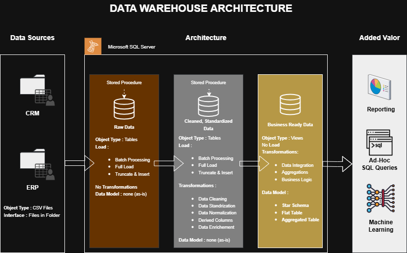

---

# SQL Server Data Warehouse & Analytics 🚀

Hey there, and welcome to the **SQL Data Warehouse & Analytics Project**!
This repo walks through the full journey of building a **data warehouse** and using it to unlock **business insights**.
Think of it as a practical, portfolio-style project where you can see how raw files turn into meaningful analytics.

---

## 🏗️ How the Architecture Works

The project follows the **Medallion Architecture** model with three simple layers:


* **Bronze Layer** → Raw CSV data from ERP & CRM, loaded into SQL Server.
* **Silver Layer** → Cleaned, standardized, and business-friendly data.
* **Gold Layer** → Final star schema, ready to be queried for analytics and reporting.

---

## 📖 What This Project Includes

Here’s what you’ll find inside:

1. **Architecture Design** – Bronze, Silver, and Gold layers for a modern data warehouse.
2. **ETL Workflows** – Load, clean, and transform CSV data into SQL Server.
3. **Data Models** – Fact and dimension tables optimized for queries.
4. **Analytics** – SQL-based reports and dashboards to generate insights.

🎯 Skills you’ll practice or showcase:

* SQL Development
* Data Architecture & Modeling
* Building ETL Pipelines
* Data Engineering Foundations
* Business Analytics

---

## 🛠️ Tools & Free Resources

Everything in this setup uses **free tools**:

* 📂 [Datasets](datasets/) – CSV files from ERP & CRM
* 🗄️ [SQL Server Express](https://www.microsoft.com/en-us/sql-server/sql-server-downloads) – free SQL Server edition
* 🖥️ [SSMS](https://learn.microsoft.com/en-us/sql/ssms/download-sql-server-management-studio-ssms?view=sql-server-ver16) – SQL Server Management Studio
* 📊 [Draw.io](https://www.drawio.com/) – diagrams for data flows and models
* 🌐 GitHub – for version control and sharing work

---

## 🚀 Project Focus

### 🛠️ Data Engineering Side

* Bring in CSV data from two source systems (ERP + CRM).
* Clean and resolve data quality issues.
* Create a unified, star-schema warehouse.
* Keep it lean → focus on the newest dataset only.

### 📊 Analytics Side

* Explore **customer behavior**.
* Track **product performance**.
* Discover **sales patterns and trends**.

Full requirements are here: [docs/requirements.md](docs/requirements.md).

---

## 📂 Repo Layout

```
data_warehouse_sql_project/
├── datasets/         # Source CSV files
├── docs/             # Documentation & diagrams
│   ├── data_architecture.drawio
│   ├── data_architecture.png
│   ├── data_models.drawio
│   ├── data_flow.drawio
│   ├── data_catalog.md
│   ├── naming-conventions.md
|   ├── requirements.txt
├── scripts/          # SQL ETL scripts
│   ├── bronze/       # Raw layer loads
│   ├── silver/       # Clean & transform
│   ├── gold/         # Star schema creation
├── tests/            # Validation & QA checks
├── LICENSE
├── README.md

```

---

## 🛡️ License

This project is under the [MIT License](LICENSE).
Use it, adapt it, or extend it however you like. ✨

---

## Acknowledgement

This Project is inspired by the SQL course taught by **Data with Baraa**.

---


